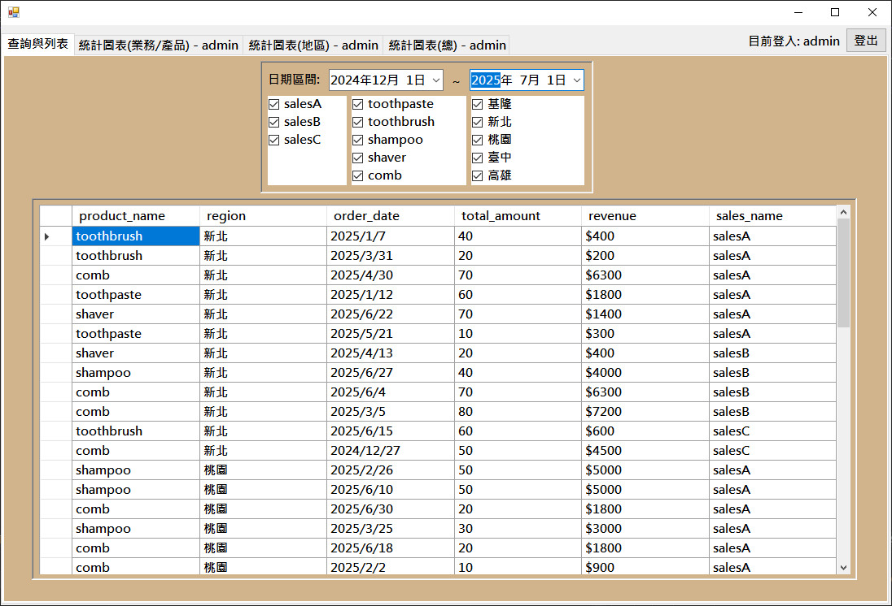
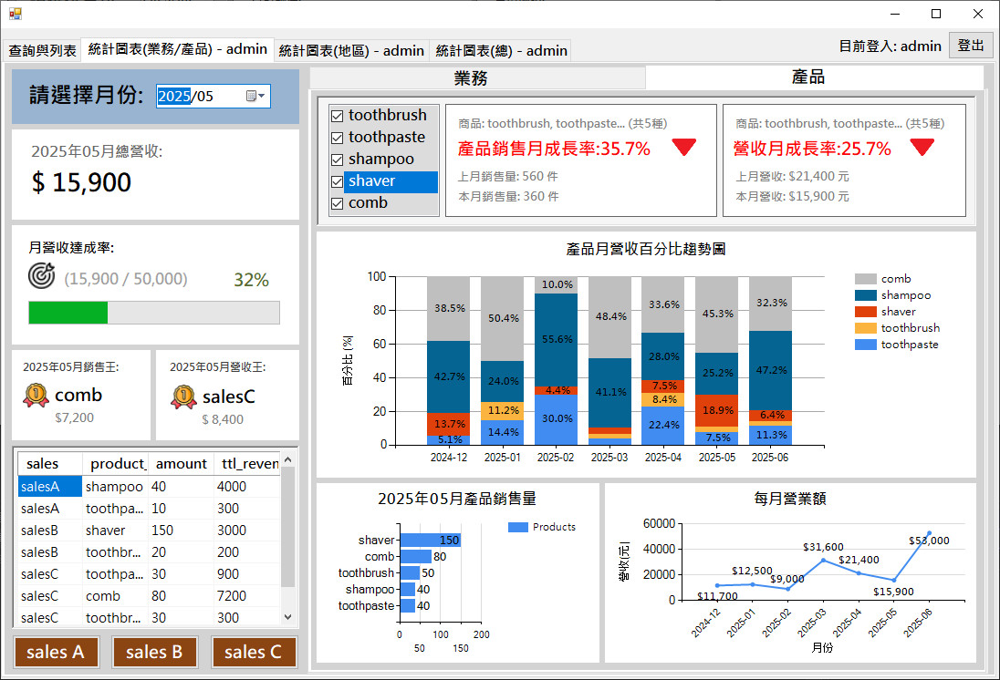
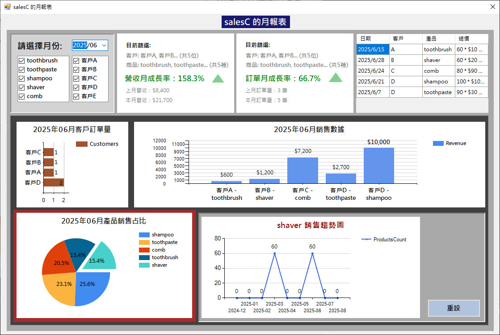

# 銷售資訊儀表板系統(Sales Dashboard System)
本專案為一套以 Visual Studio 2022 開發、採用 Windows Forms 框架的桌面型應用程式， 使用 C# 語言撰寫，搭配 MySQL 資料庫進行資料管理與用戶驗證。系統以「銷售資訊視覺化」為核心，結合圖表、分類檢視與登入權限管理，提供企業內部快速掌握銷售狀況與市場分布的解決方案。
### 本系統包含以下核心模組與功能特色:
+ 🔐 登入系統 (LoginForm) 
+ 🧾 銷售明細頁 (TabPage - 純表格檢視)
+ 📊 Sales Dashboard (使用者介面)
+ 🛠 Admin Dashboard (管理者介面) 
+ 📊 SalesMonthlyUserControl (月報表檢視元件)

## 🔐 LoginForm (登入系統)
+ 支援使用者帳號密碼登入，並採用 Hash 加密技術儲存密碼於 MySQL 資料庫中，確保用戶資訊安全。
+ 登入成功後，系統會依據身分導向對應介面(使用者 / 管理者)。

## 🧾 銷售明細頁 (TabPage - 純表格檢視)
+ 提供一個專門用來檢視完整銷售資料的分頁，透過 DataGridView 呈現。
+ User 身份可根據「產品」與「客戶」進行篩選，快速定位目標交易資料。
+ Admin 身份則可進一步使用「產品」、「地區」與「業務人員」等條件進行多維篩選，方便針對特定區域或負責人做績效追蹤。

   
## 📊 Sales Dashboard(業務的使用者介面) + 月統計圖表
+ 銷售數據可依「產品」與「客戶」篩選查看，並即時呈現營收與訂單的月成長率。
+ 下方圖表可視化顯示訂單數量、銷售金額與產品佔比，點選圖表項目可查看趨勢折線圖。

  
+ 整體統計圖表
  - 呈現總營收與總訂單量，並搭配年度KPI達成率，評估整體業績進度。
  - 顯示客戶與產品銷售佔比圓餅圖，掌握主要貢獻來源。
  - 透過月營收折線圖與月訂單數直條圖，追蹤銷售成長趨勢。
  - 排名前三的客戶訂單量與產品銷售量以長條圖呈現，快速辨識主力客群與熱銷品。 
  - 額外列出最大客戶、營收最高產品、最熱銷產品等指標資訊。

 
## 🛠 Admin Dashboard(管理者介面)
+ 提供進階分類檢視功能，可依「產品」與「業務人員」進行統計分析。
+ 可進行整體性統計圖表檢視，有助於管理層決策與績效評估。
+ 左下設有「檢視詳細月報表」的按鈕，點擊後可快速切換至指定的 Sales 月報表頁面，深入觀察每月的交易明細與趨勢變化。

+ 🛍 產品
  - 上：可選擇月份並依產品篩選，顯示當月產品總營收、月營收達成率與月成長率。
  - 中：呈現「產品月營收百分比趨勢圖」，比較不同產品在每月的營收占比變化。
  - 下：顯示所選月份的產品銷售數量(橫條圖)與總營業額(折線圖)，方便掌握整體銷售動能。

  
+ 👤 業務
  - 上：可選擇月份查看各業務員的當月營收與成長率，並顯示對應的訂單數量橫條圖。 
  - 中：顯示每月各業務營收占比的 100% 堆疊直條圖，清楚比較各人在不同月份的貢獻比例。
  - 下：呈現當月各業務的銷售占比圓餅圖，快速看出主力貢獻者，以及整合顯示全體每月總營業額變化，方便觀察整體營運走勢。

  
+ 👤 指定的 Sales 月報表頁面
  - 根據所點選的按鈕載入不同業務的月報表頁面。
  - 銷售數據可依「產品」與「客戶」篩選查看，並即時呈現營收與訂單的月成長率。
  - 下方圖表可視化顯示訂單數量、銷售金額與產品佔比，點選圖表項目可查看趨勢折線圖。

+ 🗺 地區統計圖表
  - 提供以「地區 + 產品」為主的分析視角，顯示地區內產品營收排名長條圖。
  - 呈現地區內產品的營收占比圓餅圖，輔助判斷產品組合結構。
  - 展示產品在不同地區的營收表現，建議以圓餅圖呈現較易比較(如分類固定)，若需顯示多維分布可保留雷達圖。
  - 下方折線圖追蹤各地區每月營收變化趨勢，掌握成長或衰退情形。
  - 彙總顯示總營收最高地區、各地區總營收雷達圖及營收占比，便於掌握主力市場。

  
+ 整體統計圖表
  - 顯示全公司總營收與總訂單量 KPI 達成率，掌握年度整體績效。
  - 呈現季度營業額直條圖，追蹤公司每季營收表現變化。
  - 透過圓餅圖呈現業務員銷售占比與產品銷售占比，快速看出主要貢獻來源。
  - 顯示產品營收第一名、最熱銷產品、銷售王業務員與最大客戶等重點指標。
  - 提供每月營收折線圖與每月業務銷售占比(100%堆疊直條圖)，掌握營收趨勢與人員貢獻分布。

當初的設計主軸，是打造一套專為企業內部使用的入門級數據分析與決策支援系統。整體著重於「資料視覺化」與「權限導向操作」，不僅讓使用者能清楚掌握銷售資訊，也結合了基本的身份驗證與權限分流機制，符合實際商業應用的需求。
 